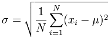

# Lecture 15: Statistical Thinking

#### _How many samples are needed for a believable answer, to have confidence in the results?_

## Variance
* A measure of the spread of possible outcomes
* The difference in the results of many trials
* 10 trials of 100,000 are better than one trial of 1,000,000

## Standard Deviation
* The fraction of values in the result that are close to the mean

	

* The square root of ((the sum of (the square of the difference between each trial's result and the mean)) divided by the number of trials)
* Low standard deviation relative to the mean means the results are more reliable
    * "Packed around the mean"

## Coefficient of Variation
* Standard Deviation divided buy the mean
* Denotes the _relative variance_
* If the coefficient is less than 1, there is low variance in the results
* If the mean is near zero, the coefficient's meaning is less accurate
    * A small change in the mean can make a big change in the coefficient
* The coefficient cannot be used to construct confidence intervals

## The Normal Distribution
* Peaks at the mean
* Falls off symemetrically to either side of the mean
* Known as the "bell curve"
* Is frequently used for probabilistic models
    * Occurs frequently in nature
    * Has nice mathemeatical properties
    	* Can be characterized by the mean and standard deviation
    	* Can be used to compute confidence intervals

## Confidence Interval
* The range within the results likely to contain an unknown value
* **Confidence Level:** the confidence that an unknown value is within a certain range of the results
* Assumes random trials with a normal distribution of result values

## The Empiricle Rule
* With a true normal distribution:
	* 68% of the data will be within 1 standard deviation of the mean
	* 95% of the data will be within 2 standard deviations of the mean
	* 99.7% of the data will be within 3 standard deviations of the mean

## Standard Error
* An estimate of the standard deviation
* Assumes the errors are normally distributed within the results
* Assumes the sample population is small compared to the actual population

	
    
* _p_ is the percent sample of the whole population, _n_ is the sample size