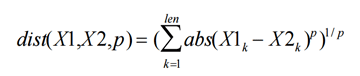

# Lecture 20: More Clustering

## Feature Vectors
* Items for clustering best represented as a vector of their features
* Issue of how to compare two vectors when different elements can mean very different things
	* Example: Temperature vs. Distance
	* A small change could be significant to one feature and meaningless to another
	* Scaling (normalization) is typically used to resolve this issue
		* The same feature in each vector is divided by the largest value of that feature
* Feature selection and scaling are _**critical**_ to good clustering
	* Knowledge of the problem domain is used to select the best features

## Minkowski Metric
* Used to find distances between points or clusters

	

* If the value of _p_ is 2, the formula computes the Euclidian distance
* If the value of _p_ is 1, the formula computes the Manhattan distance
    * only left/right, up/down movements between points, no diagonals, as is movement on the Manhattan street grid

## Nominal Categories
* Non-numeric features
* Typically converted to numbers and related numerically
* Represent judgements, not math

## Unsupervised Learning
* Used to learn about something about which there isn't specific data
* Example: learning about eating habits of mammals based on how many of what kinds of teeth they have
* Hierarchial clustering is _very_ inefficient

## K-Means Clustering Algorithm
1. Choose the value of _K_
	* Represents the total number of clusters in the result
2. Chose _K_ number of points as initial _centroids_
	* Often chosen randomly
	* A centroid is the center, or average, point in a cluster
		* It need not be an actual data point, might just be an average
3. Assign each point of the dataset to the nearest centroid
	* Do not expect anything useful from this initial clustering
4. Choose a new centroid for each cluster
5. Assign each point in the dataset to the nearest centroid
6. Repeat steps 4 and 5 until the change becomes "small"
	* "small" can refer to either the number of points that change clusters or how far the centroids move between iterations
	* This typically does not take a lot of iterations
	* Much more efficient that hierarchial clustering